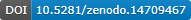

https://github.com/user-attachments/assets/1ad2210c-da95-45f6-ab59-27d5647b267a
# AI4Loc
Artificial intelligence for single molecule localization microscopy (SMLM), 
this is a framework for developing deep learning based 3D localization algorithms.

# LUNAR: Localization Using Neural-physics Adaptive Reconstruction
This is the official implementation of the paper 
"Aberration-aware 3D localization microscopy via self-supervised neural-physics learning", 
distributed as a part of the AI4Loc framework.

A brief video introduction to the characteristics of LUNAR:
https://github.com/user-attachments/assets/1ad2210c-da95-45f6-ab59-27d5647b267a


* whole-cell Nup96 NPC imaging with a 6 μm DMO Tetrapod PSF
<p align="left">
    
</p>

* Neuron imaging at 50 μm depth in brain slice.
<p align="left">
    
</p>

* 20 μm thick whole-cell reconstruction with motor-PAINT and lattice light-sheet microscopy.
<p align="left">
    
</p>

## Installation
The code was tested on Windows 11 and Ubuntu 22.04.5 LTS system, 
with software environment managed by Anaconda.
Packages required can be found in `requirements.txt`.  

To install LUNAR, please follow the steps below:

1. Clone the repository:
```commandline
git clone https://github.com/fffffsssss/AI4Loc.git
cd AI4Loc
```

2. Create a new conda environment:
```commandline
conda create --name ailoc python=3.9.7 
```

3. Activate the environment and install the required packages:
```commandline
conda activate ailoc
pip install -r requirements.txt
```

4. Run demos:
```commandline
# get into the demos directory
cd demos

# run the demos sequentially
python demo1-simu_tubulin_tetra6.py
python demo2.1-psf_calibration.py
python demo2.2-exp_npc_dmo1.2.py
python demo3-exp_whole_cell_tetra6.py
```

The project files should be organized as the following hierarchy:
```
├── root
│   ├── ailoc
│   │   ├── common                       // common tools used by all algorithms
│   │   │   ├── xxloc.py                 // the abstract class xxloc
│   │   │   ├── vectorpsf_fit            // module for vector PSF calibration from beads
│   │   │   ├── analyzer.py              // utilize xxloc to analyze experimental data
│   │   │   ├── ...                      // other common modules, such as notebook_gui, utilities...
│   │   ├── simulation                   // simulation tools
│   │   │   ├── simulator.py             // the simulator class for generating SMLM data
│   │   │   ├── ...                      // other simulation modules such as PSF, camera, etc.
│   │   ├── deeploc                      // the implementation of deeploc
│   │   │   ├── deeploc.py               // deeploc class, which inherits from xxloc
│   │   │   ├── network.py               // the network of deeploc, implement with forward function
│   │   │   ├── loss.py                  // the loss function of deeploc
│   │   ├── lunar                        // the implementation of LUNAR
│   │   │   ├── lunar.py                 // lunar class, which inherits from xxloc
│   │   │   ├── network.py               // the network of lunar, implement with forward function
│   │   │   ├── ...                      // other lunar modules, such as loss, submodules, etc.
│   │   ├── ...                          // other xxloc algorithms, fd-deeploc, etc.
│   ├── datasets                         // test dataset should be put here
│   ├── results                          // results will be saved here by default
│   ├── usages                           // general usage scipts for reference
│   │   ├── notebook                     // notebook with GUI
│   │   ├── pyscripts                    // python scripts
│   ├── demos                            // several demos to show how to use the framework
```

## Demos
We recommend running the demos on a GPU with at least 24GB of memory. 
If such a GPU is unavailable, 
you can reduce the `batch_size` or `context_size` to lower GPU memory usage during training. 
(e.g., `batch_size=1`, `context_size=8`)

We provide several demos in the `demos` directory, illustrating use cases such as beads calibration, 
localization learning based on the calibration, and synchronized learning directly on raw data. 
For all demos: 

* Data should be downloaded from [](https://doi.org/10.5281/zenodo.14709467)
 and put in the `datasets` directory.
* Results will be automatically saved in the `results` directory.
* Localizations are saved as a `.csv` file. 

For post-processing and visualizing the localizations, 
We recommend using the [SMAP](https://www.nature.com/articles/s41592-020-0938-1) software, 
which supports tasks like rendering, filtering, and drift correction, etc.

### Demo 1: Simulated Microtubule Dataset
Demo 1 is based on simulated microtubule datasets with 6 μm Tetrapod PSF. 
You need to download the dataset.
The script `demo1-simu_tubulin_tetra6.py` trains DeepLoc and LUNAR LL with an accurate PSF, followed by LUNAR SL with a wrong PSF. 
All models were trained once with fixed density and tested on three datasets with low, medium, and high densities, respectively. 
Evaluation metrics are automatically printed out after each model's training.

### Demo 2: Experimental Nup96 NPC Dataset
Demo 2 is based on the experimental Nup96 NPC dataset with a 1.2 μm DMO Saddle-Point PSF. 
The dataset and beads for PSF calibration are provided. 
Note that this dataset has ~60 nm y-drift during data acquisition. 

* `demo2.1-psf_calibration.py`: Calibrate the PSF; calibration results are saved along with the beads file.
* `demo2.2-exp_npc_dmo1.2.py`: First train DeepLoc with the calibrated PSF, followed by DeepLoc and LUNAR SL with a wrong astigmatic PSF.

### Demo 3: Whole-Cell Nup96 NPC Dataset
Demo 3 is based on the whole-cell Nup96 NPC dataset with a 6 μm DMO Tetrapod PSF. 
The script `demo3-exp_whole_cell_tetra6.py` trains DeepLoc and LUNAR SL with a mismatched PSF.

### Demo 4: Notebooks with GUI for Demo 2
Demo 4 provides three Jupyter notebooks with graphical user interface (GUI) to demonstrate PSF calibration, model learning, and model inference. 
This demo uses the same data as Demo 2. 
A video `docs/demo4_video_1~1` is provided to show the usage of these notebooks.
